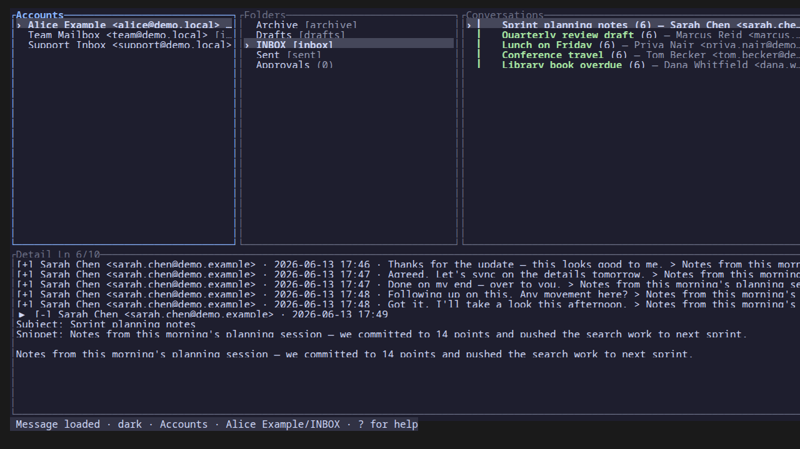
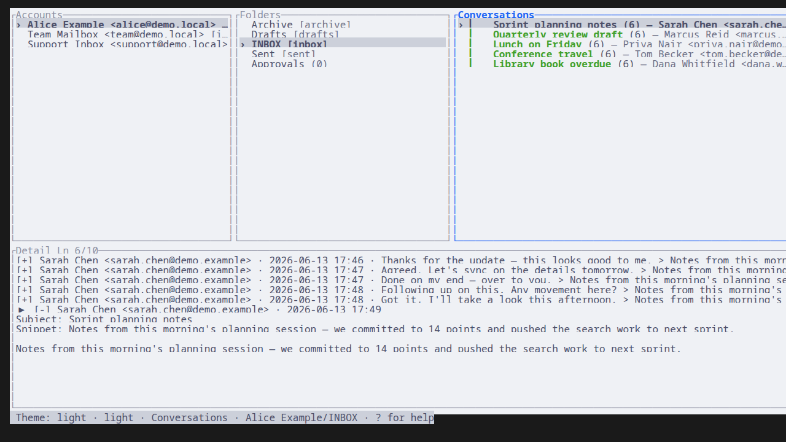

# postblox

[](https://github.com/numberyy/postblox/actions/workflows/ci.yml)
[](LICENSE-MIT)
[](LICENSE-APACHE)
[](rust-toolchain.toml)

**Local-first email TUI and MCP bridge for AI agents.**

postblox connects to email accounts you already own (Gmail, Fastmail, …),
keeps a local SQLite mirror in real time over IMAP IDLE, and exposes an
MCP bridge so AI agents can read events freely and call tools through
per-tool / per-pattern approval gates.

> **Status:** pre-1.0 and under active development. Expect rough edges
> and breaking changes. `main` is stable; day-to-day work happens on
> `dev`.

## Why

- **Beautiful, fast TUI.** Gmail-class layout, FTS5 search, live updates
  driven by IMAP IDLE.
- **MCP bridge.** Outbound notifications stream freely; inbound tool
  calls run through per-tool, per-arg-pattern approval gates.
- **Instant sync.** IDLE plus write-through actions: a flag toggle in
  the TUI is reflected on the server before the next frame renders.
- **Bring your own accounts.** No mail server, no SMTP relay, no signup.
- **One file.** Everything lives in a single SQLite database you own.

## Architecture

```
            ┌──────────────────────────────────────┐
            │              postbloxd                │
            │ ┌─────────┐  ┌────────┐  ┌─────────┐ │
            │ │ IMAP    │  │ SQLite │  │ MCP     │ │
            │ │ workers │←→│  pool  │←→│ gates   │ │
            │ └─────────┘  └────────┘  └─────────┘ │
            │            ↑↓ Unix socket            │
            └──────────────────────────────────────┘
                          ↑↓     ↑↓
                       ┌──────┐ ┌──────────┐
                       │ TUI  │ │ MCP shim │
                       └──────┘ └──────────┘
```

A single daemon owns the DB pool and the IMAP IDLE connections. Clients
(the TUI, the MCP shim) speak length-prefixed JSON frames over a Unix
socket — `~/.local/share/postblox/postbloxd.sock` by default.

## Screenshots

The TUI ships three themes; `dark` is the default.






## Install

```sh
git clone https://github.com/numberyy/postblox
cd postblox
cargo install --path . --locked
```

Requires:
- Rust **1.80+** (see `rust-toolchain.toml`)
- A POSIX system (Linux or macOS). Windows isn't supported yet.

## Quick start

```sh
just demo
```

`just demo` builds the workspace in release mode, spins up a fresh
`postbloxd` against a tempdir, seeds it with three demo accounts
(folders, threads, messages, drafts, MCP gates, pending approvals), and
launches the TUI. Quit the TUI to tear everything down — no real IMAP,
SMTP, OAuth, or keyring is touched.

For day-to-day development, `just check` runs `cargo fmt --check`,
workspace clippy with `-D warnings`, and the workspace test suite.

### Connecting a real account

```sh
# Start the daemon (foreground; ctrl-c to stop).
postbloxd

# In another shell, launch the TUI.
postblox
```

The TUI drives account setup, sync, search, reading, and composing. The
MCP bridge (`postblox-mcp`) speaks JSON-RPC over stdio for AI agents —
point your MCP client at it to read events and call gated tools. Both
clients talk to the same daemon over the Unix socket; see
`tests/ipc_integration.rs` for the raw wire format.

## Configuration

postblox reads:

- `POSTBLOX_DB` — database path (default `$XDG_DATA_HOME/postblox/postblox.db`).
- `POSTBLOX_SOCKET` — socket path (default `$XDG_RUNTIME_DIR/postblox.sock`).
- `RUST_LOG` — standard `tracing-subscriber` env filter.

Account credentials live in your OS keyring; see [`SECURITY.md`](SECURITY.md).

## Roadmap

Tracked in [`CHANGELOG.md`](CHANGELOG.md). At a glance:

- SQLite schema + FTS5 search ✅
- `postbloxd` daemon over a Unix socket ✅
- Local write-through ops + event bus ✅
- IMAP IDLE workers + SMTP submission ✅
- TUI client over the socket ✅
- MCP bridge with per-tool, per-pattern approval gates ✅
- OS keyring + Gmail OAuth2 ✅
- Optional Bitwarden secret-store backend
- Optional LLM-gateway-driven hybrid search

## Contributing

PRs are welcome. Read [`CONTRIBUTING.md`](CONTRIBUTING.md) (the project's
code rules) before opening one. Open PRs against `main`; CI must be green
before review.

## License

Dual-licensed under either of:

- [MIT](LICENSE-MIT)
- [Apache License, Version 2.0](LICENSE-APACHE)

at your option.

## Contribution

Unless you explicitly state otherwise, any contribution intentionally
submitted for inclusion in this project by you, as defined in the
Apache-2.0 license, shall be dual-licensed as above, without any
additional terms or conditions.
